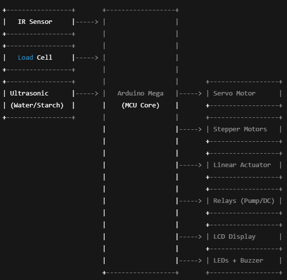

# Capstone Project – MCU-Based Charcoal Briquette Machine

## 📖 Overview
This project is our **Capstone Project** for BS Computer Engineering.  
We developed an **MCU-Based Charcoal Briquette Machine** that automates the process of **grinding, mixing, compressing, and forming charcoal briquettes**.  
The goal is to improve efficiency, reduce human effort, and support sustainable fuel alternatives.

## ✨ Key Features
- Automated **charcoal feeding, mixing, and compression**
- **Load cell** integration for real-time weight monitoring
- **Ultrasonic sensors** for starch and water level detection
- **LCD I2C display** for system feedback
- **Servo motor & linear actuator** for material control
- **Relays** for controlling water pump and DC motor
- Safety indicators: LEDs + buzzer

## ⚙️ Hardware & Software
- **MCU:** Arduino Mega (ATmega2560)
- **Sensors & Actuators:** IR sensor, servo motor, stepper motors, load cell (HX711), linear actuator, ultrasonic sensors, relays, LCD I2C
- **Programming Language:** C/C++ (Arduino IDE)
- **Design Tools:** AutoCAD (2D design), SketchUp (3D mechanical design)

## 🖼️ Project Previews
### Block Diagram

### Flowchart

### 🏗️ Prototype 3D Design (SketchUp)
[3D Design](Prototype)

### 📸 Actual Prototype
[Prototype](Actual_Prototype)

## 🚀 C/C++ Code
[Final Code](C++_Capstone_Code.docx)

